# Optional SSF overlay for github.com

A Chrome extension (Manifest V3) that overlays live SSF agent state on
github.com. Every screen it touches answers one question — **is an agent on
this, and does it need me?** — at a glance, with the detail one click away. It
reads the same canonical dashboard model as the TUI and the server's web UI, and
what it does to a factory is what an item's card offers: start a session on an
item that has none ([Assigning an agent](#assigning-an-agent)), or act on the
one that is there ([Acting on an agent](#acting-on-an-agent)).

Both the endpoint it reads and the exposure rules for reaching it are described
in the [dashboard guide](../docs/dashboard.md).

## Install

1. Enable the server endpoint. It is off by default:

   ```sh
   ssf config set dashboard.enabled true
   ```

   In VM mode this belongs to the host. An enabled listener requires a server
   restart.

2. Find the capability URL. `ssf-server` logs it when it starts:

   ```sh
   journalctl --user -u ssf.service | grep 'Server web dashboard'
   # ssf@NAME.service for a named target
   ```

   It looks like `http://127.0.0.1:8787/<secret>/`. The secret is generated
   once and kept in the factory's state directory, so this URL stays the same
   across restarts: save it once below and it keeps working. It changes when
   someone rotates the secret by deleting that file, when the `[dashboard]`
   bind or port changes, and once for a factory first running a version with
   this behaviour — that upgrade mints the first stored secret, so a URL saved
   before it must be re-entered.

3. Get the extension and load it. The `ssf` binary carries the extension that
   matches it: run `ssf chrome-extension` (it writes
   `./ssf-chrome-extension.zip`; `--output PATH` writes elsewhere, and
   `--force` replaces an existing file), or open the capability URL in a
   browser and use its **Download Chrome extension** link. Unzip it, open
   `chrome://extensions`, turn on **Developer mode**, choose **Load unpacked**,
   and select the unzipped directory (the one holding `manifest.json`). From a
   repository checkout you can instead select this `chrome-extension/`
   directory directly.

4. Open the extension's options page (the toolbar icon, or **Details → Extension
   options**) and add one entry per factory: press **Add a factory**, give it a
   label and the capability URL, and press **Save and allow**. Saving is the
   whole of it: the same click stores the factory in `chrome.storage.local` and
   asks Chrome for permission for that factory's address, which is what lets the
   extension read that factory and nothing else. A saved factory is then a fact
   on the page — its URL, its state, and **Edit** and **Remove** — rather than
   fields left open to be re-saved by accident:

   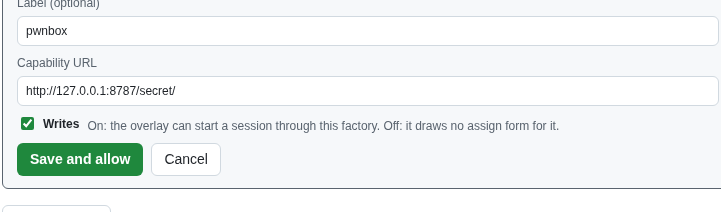

   Chrome's permission prompt appears on the first save. Refusing it leaves the
   factory saved and its row offering **Allow**, so nothing is lost and nothing
   is asked twice.

5. Open any issue or pull request in the factory's repository.

There is no build step, no npm dependency and no bundler: the extension is the
plain JavaScript, HTML and CSS in this directory. It is not part of the Arch
package; nothing here affects `makepkg`. The terminal's renderer and key mapping
have unit tests that need only Node (18 or later), no packages:
`node --test chrome-extension/test/*.test.mjs`.

### Updating a loaded copy

The browser keeps the copy it loaded, so an edited checkout changes nothing
until you reload it: open `chrome://extensions` and press **Reload** on the
extension. The options page names the version the browser is actually running
(its `manifest.json` `version`), which is how you tell a copy loaded before an
update from the current one — `chrome://extensions` shows the same number. The
behaviour of the extension changes with this version, so a fix that is in the
checkout but not in this line is not in the browser.

Each factory also carries a line saying what the overlay is getting from it, and
those two lines together answer the two ways an expected card can be missing:

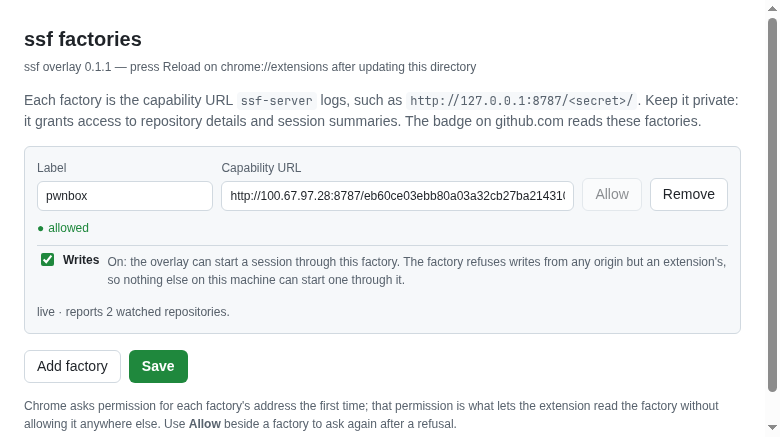

| The page shows | What it means |
| --- | --- |
| `live · reports N watched repositories` | The factory answered and publishes the repositories it watches, so an item it has no record of carries the Assign form. |
| `live · reports no watched repositories` | The factory answered but publishes none, so the overlay cannot offer the form for an item it has no record of — either it watches none, or it is an older `ssf-server` that does not publish them (see [Assigning an agent](#assigning-an-agent)). It is the server that needs updating, not the extension. |
| `stale · reports …` | The stream stopped; the states shown are from the last snapshot. |
| `unreachable: …` | The factory did not answer, in its own words or the extension's: the server or its VM is not running, the bind or port moved, or the secret was rotated since the URL was saved. |
| `not answered yet.` | The stream is connecting — shown for a factory just saved too. |

The lines are pushed by the extension's service worker, which the page keeps
awake while the page is open, so they keep up as factories come and go.

## The five states

Every state ssf and the harnesses use collapses onto one of five, each with a
fixed colour and icon so the same state reads the same on every screen:

| Shown as | Means | Raw state |
| --- | --- | --- |
| 🟢 **Working** | the agent is in a turn right now | `working` |
| 🟡 **Waiting on you** | the agent is idle or blocked; its last message is probably a question or a handoff | `idle`, `blocked` |
| ⚪ **Done** | the agent finished its turn and delivered | `done` |
| 🔴 **Problem** | ssf tracks the item but the agent or workspace is gone, or the driver is unreachable | `no-agent`, `no-workspace`, `unknown` |
| ⚫ **No agent** | ssf monitors the item with nothing attached, or the factory watches its repository and has no record of it | `unbound`, monitored items, or — for the last case — none; the overlay's own reading, shown as `no record` |

The raw word is never hidden: hovering a state line shows `ssf state: idle`, and
so does a chip's tooltip, so the overlay and the TUI always agree about what the
factory actually said. The one reading ssf did not make is the second half of
that row: an item in a repository a factory watches that the factory has no
record of — no card, and not monitored. ssf has said nothing about such an item,
so its tooltip leads with `ssf state: no record` and says where that came from,
and the overlay draws it only where it can offer the one thing that belongs to
it, the **Assign agent** form. `ssf assign` accepts any open item in a watched
repository, which is what makes "no record" actionable rather than empty (#435).

**An item the page shows closed or merged is not a Problem.** A merged item whose
workspace was released reads `no-workspace`, and one the daemon no longer tracks
reads `unbound`; both would otherwise be red, on an item there is nothing left to
run. A chip on a row the page marks closed or merged therefore renders a muted
**Done**, and keeps the raw word in its tooltip. **Working**, **Waiting on you**
and **Done** are shown as reported whatever the row says, so a closed item whose
agent is still attached still reads as its agent does. The reading comes from the
page, not from ssf's own `github_state`, which the model leaves unset for items
bound before it was recorded (#409).

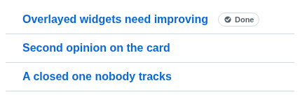

A snapshot the overlay cannot trust carries a **stale modifier** on top of the
state: the icon loses its solid fill and becomes a dashed outline, and the time
becomes `as of HH:MM` — when the snapshot was taken. That happens when the
stream stops, when the factory cannot be reached at all (`Problem ·
unreachable`), and also when a factory flags its own snapshot as unreliable — a
daemon that is not answering, an unreachable VM, an unavailable driver, an
overdue poll — which the TUI paints `UNAVAILABLE / STALE` and the server's web
UI describes as "Status may be incomplete". A stale snapshot therefore never
renders a solid **Working**. A factory that has never answered is named on the
page rather than left out, since staying silent would read as "no agent".

## What it shows

**An issue or pull request page gets a card in the right sidebar, above
Assignees:**

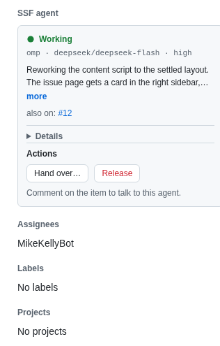

The card leads with a **band tinted by the state** — green Working, yellow
Waiting on you, grey Done or No agent, red Problem — carrying the state word,
the last activity time and SSF. The band is the only place the card uses a
state colour. Under it, always visible: the stack the session is on as
`harness`, `model` and `effort` chips (effort included because it is what the
session's tokens cost and because it is a third of what the hand-over pickers
move), the **branch** on one line with the full name in its tooltip, `on
<factory>` when there is more than one factory to tell apart, why there is no
activity time where there is none, and the last message trimmed to two lines
behind a `more` toggle that appears only when the text is really clipped. Then:

- **also on: #a #b** — the other issues this agent has taken on;
- **Details**, collapsed — every fact the card holds, one row each: what ssf
  says the state is and the raw word behind it, the item, the stack, the stack a
  **next launch** would use when it differs, what the agent is **doing**, the
  **branch** and the **workspace**, the **session** id, the **factory**, when the
  item was last **active** and why that is not known, and a **hand over** waiting
  on the daemon. A fact the factory did not send is left out rather than filled
  with "not reported" — a column of "not reported" around the one fact the card
  has is what made this section read as missing information (#439). **Factory**
  falls back to the label you gave the factory on the options page, or to its URL
  host when you gave none:

Each Details value is one line, whole in its tooltip; a workspace path is cut
from the left, so the end that tells workspaces apart stays visible.

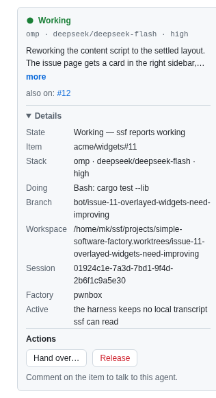

Where there is no activity time to show, nothing is shown in its place. ssf dates
a session from the local transcript its harness keeps, which is a thing an `omp`
session does not have at all — so rather than printing "no activity recorded" as
if it were a fact about the agent, the card's **Active** row says which of the
ways this happened it was: `the harness keeps no local transcript ssf can read`,
`ssf has not found the session's transcript yet`, or, for an item with no session
to date, `no agent, so nothing is running to date`. The TUI, the server's web
dashboard and the overlay all say the same sentence, because it is the model
that carries it (`activity_note`, below).

An issue that is an *additional* item of another agent shows `worked on by the
agent on #N`, with #N linked, instead of a card claiming its own agent.

**A pull request page shows the pull request's own card when a factory has
one.** That card is the factory's binding — the session tag in the body, or the
branch — so a delegated pull request shows its own session's state and its
Actions row (Message, Hand over, Release), and those act on the pull request,
not on the issue its body closes:

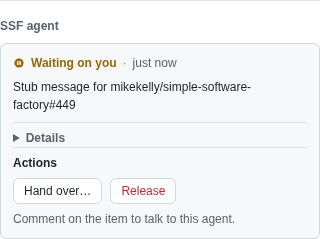

**Otherwise a pull request page resolves through the issue its body names:**
`Closes`, `Fixes` or `Resolves #N` first, then `Refs #N`, first match winning,
and the card says `for #N`:

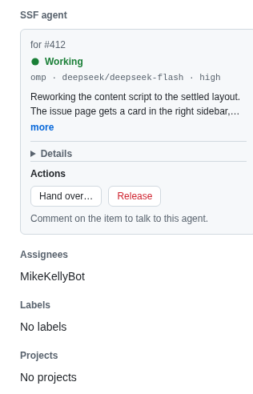

On a pull request page, the issue the body names resolves whether or not the
factory has a record of it: naming an item in a watched repository puts the form
for that item on the page, as it would on the item's own page. When the body
names nothing a factory watches or records, the card falls back to the pull
request itself, and the form starts a session on the pull request. Either way
the write is for the item the card names, never for an issue the page merely
mentions.

**A closed or merged page offers no writes.** The sidebar card reads the state
GitHub draws in the item's header, the way a chip reads its row: a finished item
reads **Done** and carries no Assign form, neither for itself nor for an issue a
merged pull request's body names. An agent still on a finished item keeps its
Actions row, so its workspace can still be released.

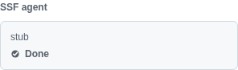

**Lists, search results and project boards get one chip per tracked item** —
icon and state word, with the relative last activity beside it where the factory
has one, and the state alone where it does not:

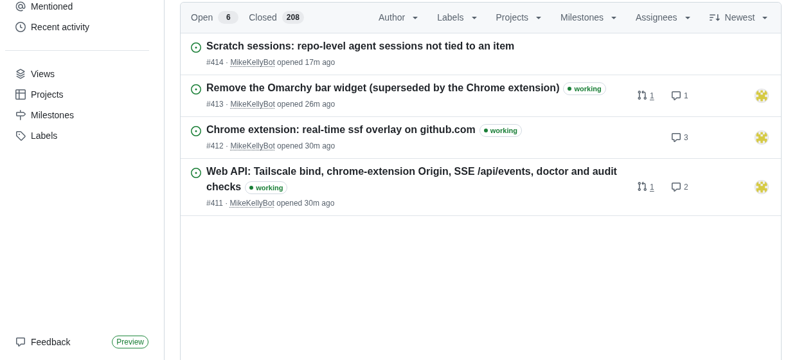

**A project board is the one list that also chips an item no factory has a
record of**, when the factory watches its repository: a board card stands for
one item and picking one up is what a board is for, so its chip opens the same
**Assign agent** form the item's own page carries. The issue and pull request
lists and search results keep one chip per tracked item, since a watched
repository's whole backlog as a column of grey chips is not what those pages are
read for:

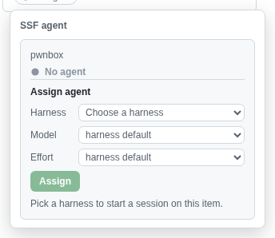

**Opening an item from a board opens a side panel over it, and the panel shows
the item's card rather than a chip.** GitHub draws that panel as a detail view
of the one item — the same sidebar container the item's page has — and names the
item it is showing in the query string (`pane=issue`, and an `issue` parameter
of the form `owner|repo|number`), which is where the overlay reads it: the card
sits at the top of the panel's sidebar, above Assignees, exactly as it does on
the item's own page, and the panel's own links get no chips. A chip belongs on a
row in a list, and the panel's links are the item itself and the issues its
prose names (#440). The parameter is the panel's own state, so closing the panel
is what takes the card away, and only the item panel carries an `issue` — the
project information panel names none, and neither does a draft item's, a draft
having no issue URL (#440).

Hovering a chip shows the stack the session is on, the absolute time where there
is one and the reason where there is not, and the first line of the last message.
Clicking it opens the same card as the issue page, as a popover, so you never
leave the board to see what an agent said — or to act on it:

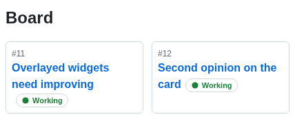

**Other pages get nothing.** The repository home, code, commits, milestones and
settings are left alone even when they link to issues.

Several factories merge by repository: a chip is unique per item, and a factory
that does not host the repository contributes nothing. When more than one
factory knows the item, each card is named with its factory label. The word on a
chip comes from a factory with something to report, so a factory that only
watches the repository — and has no record of the item, which is what puts the
form on the item's own page — never displaces the state of the factory that has
it. Both readings are in the chip's tooltip and both cards are in its popover.

## Assigning an agent

An item the factories have no agent on — the `no agent` state, whether ssf
monitors it or not — carries an **Assign agent** form, beside the item's state
on its issue or pull request page. An item with an agent shows no form.

**That includes an item no factory has a record of at all.** A factory watches a
repository, not the items in it: an item nobody has ever assigned is in none of
its cards and in none of its monitored items, and the status model used to carry
no way to tell it apart from an item the factory has never heard of — which is
why the form was missing for exactly the items `ssf assign` exists for (#435).
Each factory now publishes the repositories it watches
(`dashboard.repositories`), and an item in one of them that has no record reads
**No agent** and carries the form, on its own page and on a board card:

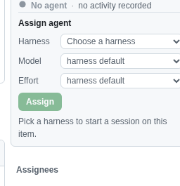

An item the page shows **closed or merged** carries the form like any other: the
write is deferred rather than refused — `ssf assign` assigns the bot and its own
result says no session starts until the item is open again — which is how a
tracked closed item already behaves.

An item ssf already has a workspace for is the exception: `ssf assign` refuses
it, because `ssf release` is what frees it, so the overlay offers no form and its
card says **Has a workspace; release it first** instead. The status model
publishes that fact per item (`has_workspace`, with the workspace `branch` when
the driver reports one), which is what lets the overlay tell such an item from
one that takes a session — before, the form was drawn and the write came back
`409`.

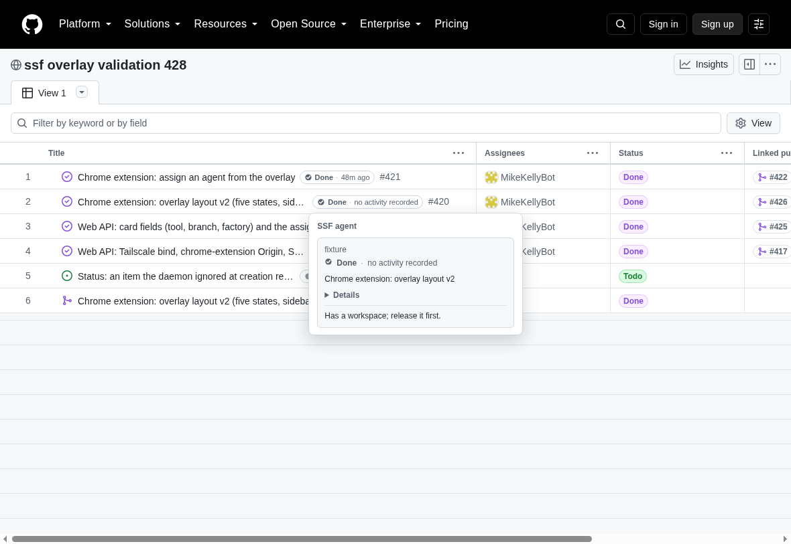

The three frames below are one assignment of `omp · deepseek/deepseek-flash ·
high` on an issue page: the factory is a throwaway that serves the server's own
contract (the same `api/status` model, `api/agents`, `api/models/<harness>` and
the write in `POST api/assign`), so the frames are the real `api/events` path
and the write is a real `POST` with `Origin: chrome-extension://…`. The refusal
below is a real factory's own words, forwarded unchanged.

| Before | While it starts | After the frame |
| --- | --- | --- |
| 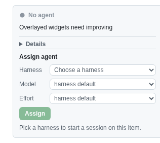 | 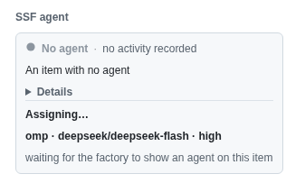 | 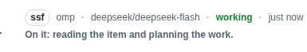 |

A refusal is the server's own words, with the form kept and nothing retried:

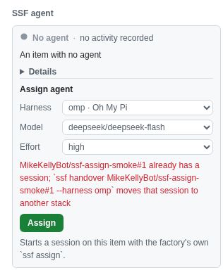

- **Harness** comes from the factory's own `ssf agents`, and is required.
  **Model** comes from `ssf models <harness>` with the harness's own default
  first, and **Effort** offers the harness's levels. Leaving either at *harness
  default* sends no model or effort at all, so the factory's own rules apply.
  A harness that takes no model setting, or no effort level, is offered
  neither: `ssf assign` would refuse one.
- Which factory takes the session is decided for you when one factory that
  knows the item accepts writes; when more than one does, a **Factory** picker
  comes first.
- **Assign** starts the session with the factory's own `ssf assign`: the same
  item, harness, model and effort `ssf assign <item> --harness ID` would use.
  The form reads *Assigning…* until a frame shows the item with an agent, which
  is the frame that ends it. If none does within 30 seconds, what the factory
  returned is shown with a link to its dashboard.
- A refusal — an item that already has a session, a repository the factory does
  not watch, a harness it does not know — is shown in the server's own words,
  inline, with the form still there. Nothing is retried for you.

## Acting on an agent

An item whose state is **Working**, **Waiting on you**, **Done** or **Problem**
carries an **Actions** row on the card of the factory that has it — **Show
agent**, which opens the agent's terminal over the page, and a **•••** menu
holding Hand over… and Release, both sent from the service worker and never
from the page. A second
factory with an agent on the same item draws its own row, so each session is
acted on through the factory that runs it:

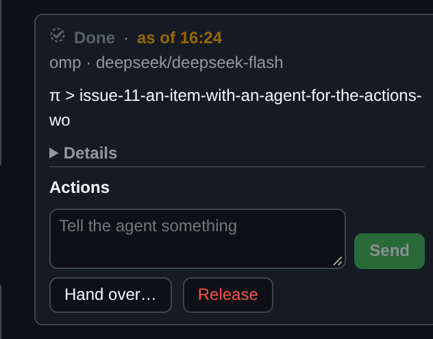

The row starts, moves and frees sessions. It does not talk to them: **a person
speaks to an agent by commenting on the item**, which is what the note under the
buttons says. A comment is delivered to the session the same way the item's own
activity is, and it stays on the item afterwards, where everyone working it can
read it. A text box on a card could only ever be a second conversation with
nobody else in it (#439).

The same row is on the card a list, search or board chip opens as a popover, so
an item can be acted on without leaving the board:

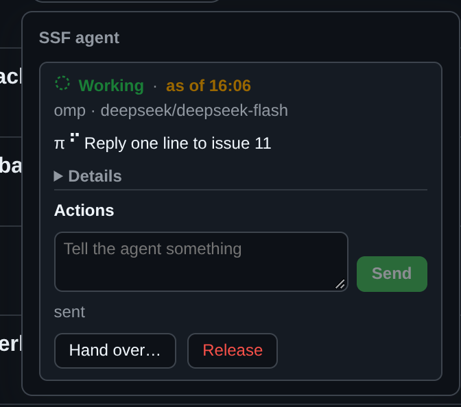

- **Hand over…** offers the same pickers as the assign form, **prefilled with
  the stack the card is on**, plus an optional note the new session reads before
  the item's story. Hand-over ends the session that is there and starts the new
  one in the same workspace, on the daemon's next pass:

  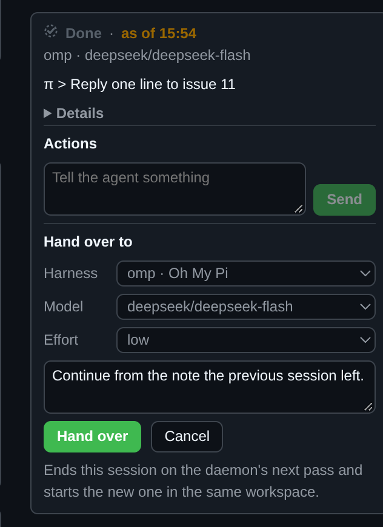

  Asking for the stack the item is already on is the factory's own refusal, next
  to the pickers that produced it; an accepted hand-over says what it recorded:

  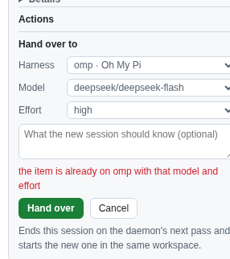

  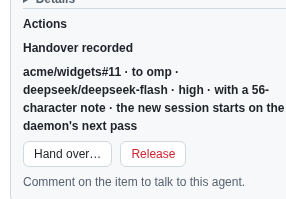

- **Release** asks first, naming the branch, because the workspace and the work
  in it are what goes:

  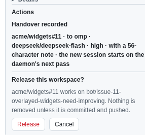

  It is never forced from here: the factory's own checks decide, and its refusal
  is shown verbatim — one check per line — with the confirm still standing:

  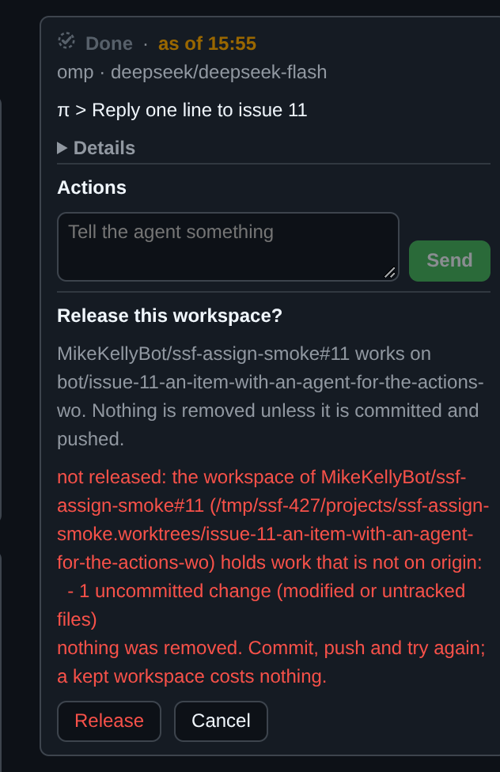

  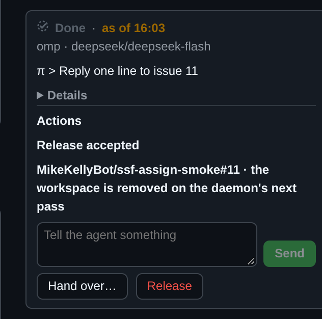

**Writes** switches on the options page, on by default, govern all of it.
Turning one off hides the assign form, the Actions row and Show agent for that
factory and refuses every write in the service worker. It is the extension's
own side of the rule the factory enforces: the server accepts a write only from
an extension origin, so nothing else that can reach a capability URL can act on
a session through it.

## Scratch sessions and the terminal

On any page of a repository a factory watches, GitHub's top bar gets an
**SSF · N active** button next to the repository's name, N being its live
scratch sessions (`ssf scratch`) and its item sessions with an agent, with a
⚠ mark while any warning applies. A click opens the SSF HUD, a popover with,
in order:

- **Warnings**: the factory's own warning (unreachable, driver down, stale),
  the daemon's last error, a factory the extension cannot reach, a compact
  **N doctor warnings** line (from the daemon's cached `ssf doctor` run; hover
  it for the messages), and each item
  in the repository whose harness is not signed in. Left out when there is
  none.
- **Active sessions**: each issue or pull request with an agent, linked, with
  its GitHub state, agent state and harness.
- **Scratch sessions**: a card per factory, described below.
- **Recently released**: items and scratch sessions released and still in the
  factory's record, newest first. Left out when there is none.
- **Harnesses**: the factory's installed harnesses (`ssf agents`), those with
  a session not signed in marked so, each with what is left of its provider
  allowance (`ssf usage`): `claude · 5h 42% (resets 16:10) · week 18%`
  (the share of each window used), `omp · $12.40`, or `no usage data`.

In the Scratch sessions card, **New scratch** offers the harness,
model and effort pickers and whose session it is: **Shared**, or **Mine**
(the login GitHub's page names in `<meta name="user-login">`). That login only
labels the session; it is not access control.

A Projects v2 board (`github.com/users|orgs/owner/projects/N`, any view, or
`github.com/owner/name/projects/N`) gets the same button next to the project's
name. It serves every watched repository linked to that project, which the
factory reads from GitHub for each repository it watches (at most every ten
minutes); an empty board still has them. With more than one, the rows name
their repository and **New scratch** has a **Repository** picker. A factory
too old to publish linked projects shows no button on a board.

Where GitHub's top bar cannot be found (a page without the global header), no
button is drawn.

**New scratch** opens the new session's terminal as soon as the factory has
started it. The list reads each session's `state` from the factory:

- **Live** sessions have **Open** (the terminal icon) and a red **×** that
  kills the session.
- **Off** sessions still have a workspace but their harness is not running:
  it exited (Ctrl+C in the terminal, say), or the factory restarted and has
  not started it again yet. They have **Resume**, which starts the harness
  again in the same workspace, resuming its conversation, and the **×**.
- **Released** sessions (killed) are under their own **Released** tab, each
  with **Resume**, which recreates the workspace on the session's branch. The
  factory keeps one for 24 hours after its release
  (`daemon.scratch_release_grace_hours`) and then drops it: the row goes from
  the tab, and a resume is refused because the session is no longer known.

The **×** asks only when there is something to lose. When the factory's checks
find nothing uncommitted or unpushed, the session is killed at once; when they
find work, the card shows what they found, warns that it will be lost, and only
**Kill anyway** (a second request, forced) removes it.

**Open** — **Show agent** at the head of an item's Actions row (on a factory
whose Writes switch is on) and the terminal icon at the end of a scratch
session's first line — opens
the session's terminal in a window floating over the GitHub page. The window is
not modal: the page underneath still scrolls and takes clicks. Drag it by its
title bar (which names the session), resize it from its bottom-right corner
(down to 320×200 pixels), and close it with its **×**, or Esc while the title
bar has focus; Esc in the terminal is a key the terminal reads. It is kept
inside the browser window, and the place and size you last gave a window is
remembered for the next one. Each session has one window: open several
sessions and each gets its own, set a little down and right of the last; a
click on a window brings it to the front, and Open on a session whose window is
already open brings that window forward.

A **scratch session**'s window is a live terminal: [xterm.js](https://xtermjs.org/)
attached to the session's tmux session through the factory's `api/term/<session>`
WebSocket (`ws://`, or `wss://` for an `https://` factory URL). It is sized to
the window, and the tmux session follows its size; everything the terminal
takes (keys, paste, mouse) goes straight to the session, so there is no Type
button. On a factory whose Writes switch is off it is view-only. When the
socket closes — the session ended (its harness exited, or it was killed), the
factory went away, or the extension's service worker stopped — the terminal
says so and offers **Reconnect**, and **Resume** to start a session that ended
again. The terminal never moves on to another session: ssf's tmux sessions
detach their terminal when they end.

An **item**'s window is also a live xterm.js terminal on `api/term/<session>`,
which for an item streams the agent's herdr pane (`herdr terminal session
observe|control`; see [docs/dashboard.md](../docs/dashboard.md)). It opens
**read-only** at the pane's own size, the font shrunk (never enlarged) so the
whole pane fits the window: nothing you type or paste is sent, and a notice
under the title bar says so. The wheel up opens a read-only history view of the
pane's recent output (read once from the redacted `api/pane/<session>` stream
on the `ssf-pane` port) over the live terminal; scrolling it to the bottom, or
Esc, goes back to live. It sends nothing to the pane.

Where the snapshot says the pane takes typing (`pane_input`: only where the
factory's `item_pane_input` is on), the factory's Writes switch is on, and the
factory gives this extension control, the terminal has a **Type** button. With
Type on, the terminal asks for control of the pane, takes it at the window's
size, and everything typed goes straight to the pane; the factory checks
`item_pane_input` again and never takes the pane over from someone else. Type
turns itself off, giving the pane back, when the tab is hidden, after half an
hour with nothing typed, when the Writes switch is turned off, or when someone
else takes the pane over, and the notice says why. herdr keeps the pane's
scrollback, so the terminal keeps none: while typing, each wheel notch scrolls
the pane one step, Shift+Enter sends a newline that does not submit (ESC CR),
and a paste is always sent as a bracketed paste. Speak to an item's agent otherwise by commenting on the item.
When the socket closes the terminal says so and offers **Reconnect**.

The older pane mirror (`pane-render.js`, `pane-keys.js`, the mirror half of
`terminal.js`) is no longer opened for any session, though the history view
still reads `api/pane/<session>`; it is kept until [#564](https://github.com/mikekelly/simple-software-factory/issues/564)
removes it.

## Reaching a factory on a tailnet

A tailnet factory needs `dashboard.bind` set to a Tailscale address; see
[the dashboard guide](../docs/dashboard.md) for the accepted binds and the
exposure rules that go with them. The transport is plain HTTP, encrypted by
WireGuard between tailnet devices and by nothing else, so treat the capability
URL as a secret and paste it only into this extension or a browser on the
tailnet. Never expose the port through Tailscale Funnel or a router port
forward, and keep tailnet ACLs restrictive.

## How it works

- The **service worker** keeps one `EventSource` per configured factory on
  `api/events`, which the server answers with a snapshot on connect and on every
  change, and reconnects with exponential backoff (1s to 60s) when a stream
  fails. The latest snapshot per factory is held in memory and served to content
  scripts, one factory's failure never affecting another's.
- The **content script** on `https://github.com/*` renders from that snapshot,
  re-rendering on GitHub's client-side navigation and DOM updates without
  duplicating what it has already drawn. A frame is drawn from scratch and
  reconciled into what is already on the page: nodes that did not change are
  left where they are, so the stream repainting every couple of seconds does not
  replace what the reader is holding — a picker keeps its open list and a box
  keeps its caret, and what the reader has opened (the full last message, the
  Details section, an open popover) stays open rather than collapsing. Every
  node is built with `textContent` and lives in a shadow root, so no factory
  text is ever parsed as HTML and no GitHub style leaks in.
- The **service worker** also carries every write and the two listings the
  forms' pickers need: `api/assign`, `api/handover`, `api/release`, the
  scratch routes, `api/pane/input`, `api/agents` and `api/models/<harness>`,
  and it opens a terminal's `api/term/<session>` WebSocket, passing it on a port. The terminal is the extension's own page (`terminal.html`), framed over
  github.com and listed in `web_accessible_resources` for github.com alone; it
  talks to no factory itself, since Chrome's local-network rules can hold a
  request from a frame under a public page to a factory on a private or
  tailnet address. A factory accepts a write only from an extension
  origin, and a page on github.com has none, so the content script never fetches
  a factory itself and no page the factory serves can act on a session.
- `host_permissions` is `https://github.com/*`. Factory addresses are
  `optional_host_permissions`, requested at runtime from the options page, so
  the extension only holds access to the factories you added.

## Limitations

- The capability URL is stable across restarts, so a saved factory keeps
  working. It changes when the secret is rotated (deleting the factory state
  directory's `dashboard-token`) or the `[dashboard]` bind or port moves; the
  options page must then be updated to match, or the factory reads as
  unreachable.
- A project board chip depends on the board rendering its cards as links to the
  issue or pull request, as GitHub's board and list views do. The side panel's
  card depends on the panel naming the item it shows in the query string
  (`pane=issue` with an `issue` parameter of the form `owner|repo|number`),
  which GitHub does for the item panel and for no other; a GitHub that renames
  that parameter takes the panel's card away with it, and the panel's own links
  stay unchipped either way, a chip belonging to a row in a list and not to a
  detail view.
- The closed-or-merged reading is a chip's, from the state mark GitHub draws in
  the item's own area — the nearest ancestor holding exactly one state mark,
  stopping at the first link to a different item, so a board column or a search
  results list cannot answer for a card. The chip's popover agrees with it. A
  sidebar card reads the page header's state label instead; a page whose header
  this version cannot read keeps the factory's own report. A card whose own cross-reference badge (a board card's
  `#N` token, an issue list's linked-PR button) sits between the title and the
  state mark also keeps the factory's own report, so the worst case is a red
  **Problem** on a closed item rather than a claim that a live item is done;
  GitHub's board, issue list, pull request list and search results all put the
  state mark below that badge, so the reading holds on every surface measured.
- Chrome prompts for each factory address once; until it is allowed, the page
  says so rather than showing state it cannot read.
- The board chip for an item no factory has a record of depends on the factory
  publishing the repositories it watches (`dashboard.repositories`, added for
  this). A factory running an older `ssf-server` publishes none, and the overlay
  then behaves as it did before: the item's page and its board card carry
  nothing. The options page says `reports no watched repositories` for such a
  factory, so it is not a silent difference.
- The Actions row is on an item's own card, not on an item shown as *worked on
  by the agent on #N*: that card is a pointer to the same session, and its own
  card carries the actions. A comment on the item still reaches the session that
  works it.
- The (unused) item mirror draws the pane's rows at the window's width, not the pane's, so a
  line longer than the panel wraps and the pane's own column layout is kept
  only where it matters: in a clipped border row and a table's own box. A table
  the pane had already wrapped at its own width cannot be put back together, and
  a box's vertical strokes show small gaps between rows, which are 1.25em apart.

## Credits

The terminal's renderer and key mapping (`pane-render.js`, `pane-keys.js`, and
the painted-glyph rules in `terminal.css`) are ported from
[collie](https://github.com/AltanS/collie) by Altan Sarisin, under the MIT
license; each file carries the notice.

The live terminal is [xterm.js](https://github.com/xtermjs/xterm.js) with
its fit addon, vendored unmodified in `vendor/xterm/` (a Manifest V3 extension
may load no remote code) from the npm registry: `@xterm/xterm` 6.0.0
(`lib/xterm.mjs`, `css/xterm.css`) and `@xterm/addon-fit` 0.11.0
(`lib/addon-fit.mjs`), under the MIT license (`LICENSE-xterm`,
`LICENSE-addon-fit`). To update them, `npm pack` the new versions, copy the
same files over, and change the versions here.
