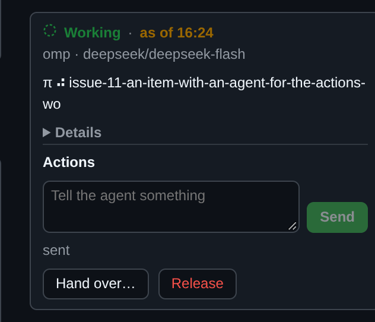
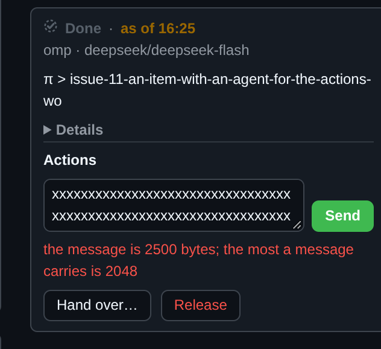

# Optional SSF overlay for github.com

A Chrome extension (Manifest V3) that overlays live SSF agent state on
github.com. Every screen it touches answers one question — **is an agent on
this, and does it need me?** — at a glance, with the detail one click away. It
reads the same canonical dashboard model as the TUI and the server's web UI, and
what it does to a factory is what an item's card offers: start a session on an
item that has none ([Assigning an agent](#assigning-an-agent)), or act on the
one that is there ([Acting on an agent](#acting-on-an-agent)).

Both the endpoint it reads and the exposure rules for reaching it are described
in the [dashboard guide](../docs/dashboard.md).

## Install

1. Enable the server endpoint. It is off by default:

   ```sh
   ssf config set dashboard.enabled true
   ```

   In VM mode this belongs to the host. An enabled listener requires a server
   restart.

2. Find the capability URL. `ssf-server` logs it when it starts:

   ```sh
   journalctl --user -u ssf.service | grep 'Server web dashboard'
   # ssf@NAME.service for a named target
   ```

   It looks like `http://127.0.0.1:8787/<secret>/`. It changes on every server
   restart, so re-save it when the server restarts.

3. Load the extension: open `chrome://extensions`, turn on **Developer mode**,
   choose **Load unpacked**, and select this `chrome-extension/` directory.

4. Open the extension's options page (the toolbar icon, or **Details → Extension
   options**) and add one entry per factory: a label and the capability URL.
   Chrome asks permission for each factory's address the first time; that
   permission is what lets the extension read that factory and nothing else.
   **Save** stores the list in `chrome.storage.local`.

5. Open any issue or pull request in the factory's repository.

There is no build step, no npm dependency and no bundler: the extension is the
plain JavaScript, HTML and CSS in this directory. It is not part of the Arch
package; nothing here affects `makepkg`.

## The five states

Every state ssf and the harnesses use collapses onto one of five, each with a
fixed colour and icon so the same state reads the same on every screen:

| Shown as | Means | Raw state |
| --- | --- | --- |
| 🟢 **Working** | the agent is in a turn right now | `working` |
| 🟡 **Waiting on you** | the agent is idle or blocked; its last message is probably a question or a handoff | `idle`, `blocked` |
| ⚪ **Done** | the agent finished its turn and delivered | `done` |
| 🔴 **Problem** | ssf tracks the item but the agent or workspace is gone, or the driver is unreachable | `no-agent`, `no-workspace`, `unknown` |
| ⚫ **No agent** | ssf monitors the item; nothing is attached | `unbound`, monitored items |

The raw word is never hidden: hovering a state line shows `ssf state: idle`, and
so does a chip's tooltip, so the overlay and the TUI always agree about what the
factory actually said.

**An item the page shows closed or merged is not a Problem.** A merged item whose
workspace was released reads `no-workspace`, and one the daemon no longer tracks
reads `unbound`; both would otherwise be red, on an item there is nothing left to
run. A chip on a row the page marks closed or merged therefore renders a muted
**Done**, and keeps the raw word in its tooltip. **Working**, **Waiting on you**
and **Done** are shown as reported whatever the row says, so a closed item whose
agent is still attached still reads as its agent does. The reading comes from the
page, not from ssf's own `github_state`, which the model leaves unset for items
bound before it was recorded (#409).


A snapshot the overlay cannot trust carries a **stale modifier** on top of the
state: the icon loses its solid fill and becomes a dashed outline, and the time
becomes `as of HH:MM` — when the snapshot was taken. That happens when the
stream stops, when the factory cannot be reached at all (`Problem ·
unreachable`), and also when a factory flags its own snapshot as unreliable — an
inactive service, an unreachable VM, an unavailable driver, an overdue poll —
which the TUI paints `UNAVAILABLE / STALE` and the server's web UI describes as
"Status may be incomplete". A stale snapshot therefore never renders a solid
**Working**. A factory that has never answered is named on the page rather than
left out, since staying silent would read as "no agent".

## What it shows

**An issue or pull request page gets a card in the right sidebar, above
Assignees:**


Always visible: the state line with the relative time, `harness · model`, and
the last message trimmed to two lines behind a `more` toggle that appears only
when the text is really clipped. Then:

- **also on: #a #b** — the other issues this agent has taken on;
- **Details**, collapsed — the current tool call, the factory label, the
  workspace branch and the agent session id, from the status model's own
  fields. A field the server does not send reads "not reported" rather than
  being invented; **Factory** falls back to the label you gave the factory on
  the options page, or to its URL host when you gave none.

An issue that is an *additional* item of another agent shows `worked on by the
agent on #N`, with #N linked, instead of a card claiming its own agent.

**A pull request page resolves through the issue its body names:** `Closes`,
`Fixes` or `Resolves #N` first, then `Refs #N`, first match winning, and the card
says `for #N`:


When the body names nothing the factory knows, the pull request's own number is
used if the factory tracks it; otherwise the page gets nothing.

**Lists, search results and project boards get one chip per tracked item** —
icon, state word and relative last activity:


Hovering a chip shows `harness · model`, the absolute time and the first line of
the last message. Clicking it opens the same card as the issue page, as a
popover, so you never leave the board to see what an agent said:


**Other pages get nothing.** The repository home, code, commits, milestones and
settings are left alone even when they link to issues.

Several factories merge by repository: a chip is unique per item, and a factory
that does not host the repository contributes nothing. When more than one
factory knows the item, each card is named with its factory label.

## Assigning an agent

An item the factories have no agent on — the `no agent` state, whether ssf
monitors it or not — carries an **Assign agent** form, beside the item's state
on its issue or pull request page. An item with an agent shows no form.

An item ssf already has a workspace for is the exception: `ssf assign` refuses
it, because `ssf release` is what frees it, so the overlay offers no form and its
card says **Has a workspace; release it first** instead. The status model
publishes that fact per item (`has_workspace`, with the workspace `branch` when
the driver reports one), which is what lets the overlay tell such an item from
one that takes a session — before, the form was drawn and the write came back
`409`.


The three frames below are one assignment of `omp · deepseek/deepseek-flash ·
high` on an issue page: the factory is a throwaway that serves the server's own
contract (the same `api/status` model, `api/agents`, `api/models/<harness>` and
the write in `POST api/assign`), so the frames are the real `api/events` path
and the write is a real `POST` with `Origin: chrome-extension://…`. The refusal
below is a real factory's own words, forwarded unchanged.

| Before | While it starts | After the frame |
| --- | --- | --- |
|  |  |  |

A refusal is the server's own words, with the form kept and nothing retried:


- **Harness** comes from the factory's own `ssf agents`, and is required.
  **Model** comes from `ssf models <harness>` with the harness's own default
  first, and **Effort** offers the harness's levels. Leaving either at *harness
  default* sends no model or effort at all, so the factory's own rules apply.
  A harness that takes no model setting, or no effort level, is offered
  neither: `ssf assign` would refuse one.
- Which factory takes the session is decided for you when one factory that
  knows the item accepts writes; when more than one does, a **Factory** picker
  comes first.
- **Assign** starts the session with the factory's own `ssf assign`: the same
  item, harness, model and effort `ssf assign <item> --harness ID` would use.
  The form reads *Assigning…* until a frame shows the item with an agent, which
  is the frame that ends it. If none does within 30 seconds, what the factory
  returned is shown with a link to its dashboard.
- A refusal — an item that already has a session, a repository the factory does
  not watch, a harness it does not know — is shown in the server's own words,
  inline, with the form still there. Nothing is retried for you.

## Acting on an agent

An item whose state is **Working**, **Waiting on you**, **Done** or **Problem**
carries an **Actions** row on the card of the factory that has it — Message,
Hand over… and Release, all three sent from the service worker and never from
the page. A second factory with an agent on the same item draws its own row, so
each session is acted on through the factory that runs it:


The same row is on the card a list, search or board chip opens as a popover, so
an item can be acted on without leaving the board:


- **Message** puts what you type into the item's agent the way a comment on the
  item does — the same delivery path, so a workspace and agent that have gone
  are brought back first, and a session sitting at its harness's sign-in prompt
  is held rather than handed a prompt it cannot read. The box reads **sent**
  until a frame shows the agent has dealt with the message, or 30 seconds pass:

  

  The server's 2 KiB limit is not applied by the box; typing past it is refused
  in the factory's own words, with what you wrote still there. The hand-over
  note is left the same way: the endpoint's own bounds answer for both:

  

- **Hand over…** offers the same pickers as the assign form, **prefilled with
  the stack the card is on**, plus an optional note the new session reads before
  the item's story. Hand-over ends the session that is there and starts the new
  one in the same workspace, on the daemon's next pass:

  

  Asking for the stack the item is already on is the factory's own refusal, next
  to the pickers that produced it; an accepted hand-over says what it recorded:

  

  

- **Release** asks first, naming the branch, because the workspace and the work
  in it are what goes:

  

  It is never forced from here: the factory's own checks decide, and its refusal
  is shown verbatim — one check per line — with the confirm still standing:

  

  

**Writes** switches on the options page, on by default, govern all of it.
Turning one off hides the assign form and the Actions row for that factory and
refuses every write in the service worker. It is the extension's own side of the
rule the factory enforces: the server accepts a write only from an extension
origin, so nothing else that can reach a capability URL can act on a session
through it.

## Reaching a factory on a tailnet

A tailnet factory needs `dashboard.bind` set to a Tailscale address; see
[the dashboard guide](../docs/dashboard.md) for the accepted binds and the
exposure rules that go with them. The transport is plain HTTP, encrypted by
WireGuard between tailnet devices and by nothing else, so treat the capability
URL as a secret and paste it only into this extension or a browser on the
tailnet. Never expose the port through Tailscale Funnel or a router port
forward, and keep tailnet ACLs restrictive.

## How it works

- The **service worker** keeps one `EventSource` per configured factory on
  `api/events`, which the server answers with a snapshot on connect and on every
  change, and reconnects with exponential backoff (1s to 60s) when a stream
  fails. The latest snapshot per factory is held in memory and served to content
  scripts, one factory's failure never affecting another's.
- The **content script** on `https://github.com/*` renders from that snapshot,
  re-rendering on GitHub's client-side navigation and DOM updates without
  duplicating what it has already drawn. What the reader has opened — the full
  last message, the Details section, an open popover — survives those
  re-renders rather than collapsing under a stream that repaints every couple of
  seconds. Every node is built with `textContent` and lives in a shadow root, so
  no factory text is ever parsed as HTML and no GitHub style leaks in.
- The **service worker** also carries every write and the two listings the
  forms' pickers need: `api/assign`, `api/handover`, `api/release`,
  `api/message`, `api/agents` and `api/models/<harness>`. A factory accepts a
  write only from an extension origin, and a page on github.com has none, so the
  content script never fetches a factory itself and no page the factory serves
  can act on a session.
- `host_permissions` is `https://github.com/*`. Factory addresses are
  `optional_host_permissions`, requested at runtime from the options page, so
  the extension only holds access to the factories you added.

## Limitations

- The capability URL changes when the server restarts; the options page must be
  updated to match, or the factory reads as unreachable.
- A project board chip depends on the board rendering its cards as links to the
  issue or pull request, as GitHub's board and list views do.
- The closed-or-merged reading is a chip's, from the state mark GitHub draws in
  the item's own area — the nearest ancestor holding exactly one state mark,
  stopping at the first link to a different item, so a board column or a search
  results list cannot answer for a card. The chip's popover agrees with it. A
  sidebar card keeps the factory's own report, because on a pull request page
  the page's state belongs to the pull request while the card is about the issue
  it resolves through. A card whose own cross-reference badge (a board card's
  `#N` token, an issue list's linked-PR button) sits between the title and the
  state mark also keeps the factory's own report, so the worst case is a red
  **Problem** on a closed item rather than a claim that a live item is done;
  GitHub's board, issue list, pull request list and search results all put the
  state mark below that badge, so the reading holds on every surface measured.
- Chrome prompts for each factory address once; until it is allowed, the page
  says so rather than showing state it cannot read.
- Whether a factory watches a repository is read from that factory's snapshot,
  so a factory with nothing on the repository shows no form for it.
- The Actions row is on an item's own card, not on an item shown as *worked on
  by the agent on #N*: that card is a pointer to the same session, and its own
  card carries the actions. A message sent to a bound item still reaches the
  session that works it.
